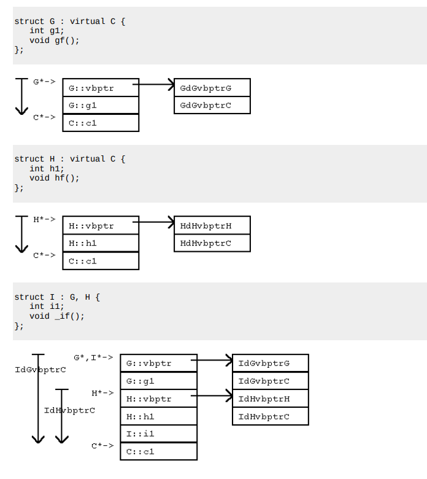

# Virtual inheritance

## Diamond problem

```cpp
class A { public: int x; };
class B : public A {};
class C : public A {};
class D : public B, public C {};
```

Mostenim pe A in D de doua ori.

Cum rezolvam? 

```cpp
class B : virtual public A {};
class C : virtual public A {};
class D : public B, public C {};
```

Acum D contine doar o copie a lui A.

Cum ar arata asta in memorie?

```
[ D object ]
+------------------+
| A (prin B)       |
|  - vPtr_A        |
|  - x             |
+------------------+
| A (prin C)       |
|  - vPtr_A        |
|  - x             |
+------------------+
| membri B         |
+------------------+
| membri C         |
+------------------+
| membri D         |
+------------------+
```

## Virtual inheritance

Virtual inheritance înseamnă că o clasă de bază este partajată (shared) între toate clasele derivate, astfel încât există o singură instanță a acelei baze în obiectul final.

Cum arata asta in memorie?

```
[ D object ]
+------------------+
| B subobject      |
|  - vPtr_B        |
|  - vbPtr ------+ |
+------------------+
| C subobject      |
|  - vPtr_C        |
|  - vbPtr ------+ |
+------------------+
| membri D         |
+------------------+
| A (shared) <-----+
|  - vPtr_A        |
|  - x             |
+------------------+
```

### vbTables, vbPtr
Cand mostenim virtual, mai exact obtinem urmatoarele comportamente:
- Se creaza vbPtr (virtual base pointer): pointer ascuns în sub-obiectele care moștenesc virtual.
- vbPtr pointeaza catre vbTable (Virtual Base Table):
    - Tabelă creată de compilator pentru a localiza baza virtuală
    - Conține offset-uri către baza virtuală în obiectul final
    - Permite ajustarea pointerului **this** pentru a ajunge la baza virtuală corectă

