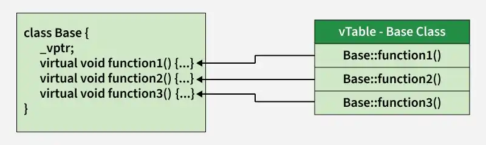
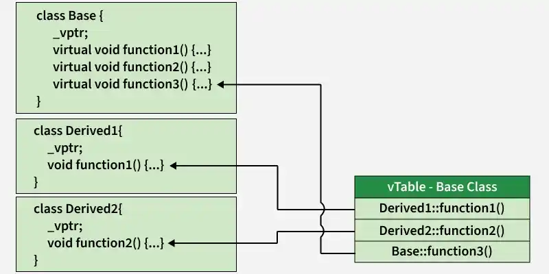
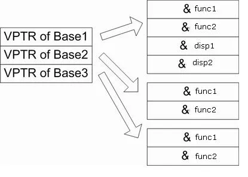
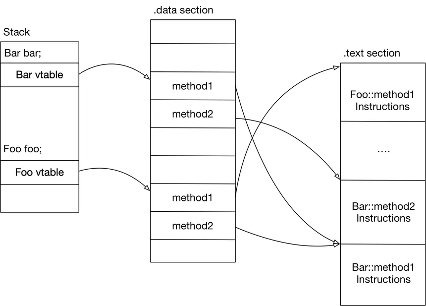

# vTables

## Virtual tables & vPtr
Atunci cand o clasa contine o functie **virtual**, compilatorul creeaza o tabela in memorie (**vTable**). 

De asemenea, fiecare obiect din clasa are acces la un pointer catre acea tabela (**vPtr**).

VTable-ul asociaza pentru fiecare functie virtuala, un pointer catre implementarea ei efectiva.

La mostenire, clasele derivate:
- mostenesc vTable-ul
- inlocuiesc intrarile pentru functiile suprascrise (override)
- daca nu exista override, se pastreaza implementarea din baza

Fie urmatoarea ierarhie:

Clasa de baza:

```cpp
class Base {
public:
    virtual void function1() {
        cout << "Base function1()" << endl;
    }
    virtual void function2() {
        cout << "Base function2()" << endl;
    }
    virtual void function3() {
        cout << "Base function3()" << endl;
    }
};
```


Clasele derivate:

```cpp
class Derived1 : public Base {
public:
    // overriding
    void function1() {
        cout << "Derived1 function1()" << endl;
    }
};

class Derived2 : public Derived1 {
public:
    // overriding function2()
    void function2() {
        cout << "Derived2 function2()" << endl;
    }
};
```




> vTabel-ul este plasat de obicei in sectiunea `.rodata` (read-only memory), desi depinde de compilator. Este alocata statica per-clasa la compilare. 

## Mostenire multipla
În cazul moștenirii multiple, un obiect poate conține mai mulți vPtr, câte unul pentru fiecare sub-obiect de bază care are funcții virtuale.

```cpp
class Base1 {
  public:
    int a;
    virtual void func1() { cout << "Base1::func1()" << endl; }
    virtual void func2() { cout << "Base1::func2()" << endl; }
};

class Base2 {
  public:
    virtual void func1() { cout << "Base2::func1()" << endl; }
    virtual void func2() { cout << "Base2::func2()" << endl; }
};

class Base3 {
  public:
    virtual void func1() { cout << "Base3::func1()" << endl; }
    virtual void func2() { cout << "Base3::func2()" << endl; }
};

class Derive : public Base1, public Base2, public Base3 {
  public:
    int b;
    virtual void disp1() { 
      cout << "Derive::disp1" << endl; 
    }
    virtual void Fnc() { 
      cout << "Derive::disp2" << endl; 
    }

};
```




## Functii virtuale pure

Ce apare in vTable pentru functii pure?

```cpp
class Base {
public:
    virtual void f() = 0;
};
```

Problema: Nu avem o implementare pentru functie.

Atunci, in vTable se pune o functie speciala numita **stub**:

- Acest stub este de obicei o functie furnizata de runtime (ex: __cxa_pure_virtual în GCC/Clang)
- Este doar un mecanism prin care indicam ca nu am suprascris functia noastra.
- Daca este apelata, de obicei arunca eroare sau termina executia.

Cum as putea sa fortez sa apelez un stub? 
```cpp
class Base {
public:
    Base() { f(); }
    virtual void f() = 0;
};

class Derived : public Base {
public:
    void f() override { cout << "Derived"; }
};
```
Compilatorul meu (gcc) imi da:
```bash
main.cpp:(.text._ZN4BaseC2Ev[_ZN4BaseC5Ev]+0x20): undefined reference to `Base::f()'
```

## Inline + Virtual
Functiile virtuale pot fi inline, dar:
- daca sunt apelate virtual, nu mai sunt inline în practică
- dacă sunt apelate direct, pot fi inline

## Recap:
- Dynamic dispatch = Late binding
    - decizia se face la runtime
    - foloseste vTable + vPtr
    - apare la functii virtuale

- Early binding = Static dispatch
    - decizia se face la compilare
    - nu implica vTable
    - apare la:
        - functii non-virtuale
        - functii inline
        - overload-uri

